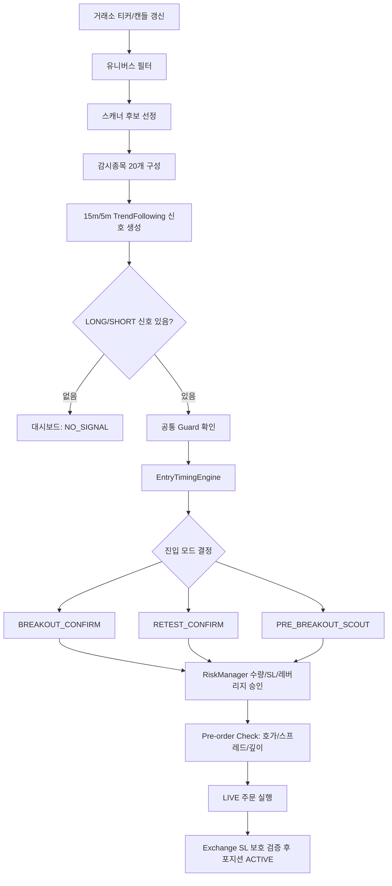

# QuantBot 종목 선정 및 포지션 진입 요약 설명본

작성일: 2026-06-07  
기준 커밋: `3ff0aeb`  
기준 파일: `config/quantbot.yaml`, `packages/scanner/symbol_scanner.py`, `packages/strategy/trend_following.py`, `packages/entry/entry_timing_engine.py`, `packages/risk/risk_manager.py`, `packages/execution/order_manager.py`

이 문서는 현재 QuantBot이 어떤 종목을 감시하고, 어떤 조건에서 LONG/SHORT 신호를 만들고, 어떤 수치로 포지션 진입까지 진행하는지 실제 구현 기준으로 요약한다.

## 1. 한 줄 요약

현재 봇은 **USDT 선물 종목 중 유동성, 변동성, 스프레드, 15분 추세, 5분 거래량이 괜찮은 상위 20개 종목**을 감시하고, 그중 **15분 추세 + 5분 정렬 + 1분봉 박스/돌파/리테스트 조건**이 맞는 경우에만 진입한다.

최근 설정은 아래 방향으로 조정되어 있다.

- 감시 범위는 20개로 유지한다.
- `WITHOUT_COMPRESSION` Scout는 더 까다롭게 보고 작게 들어간다.
- `WITH_COMPRESSION`, Breakout, Retest처럼 상대적으로 좋은 자리는 더 큰 리스크 비중과 높은 레버리지 cap을 허용한다.
- 신규 진입 MARKET 주문은 LIVE에서 금지하고, Scout/Retest는 지정가, Breakout은 IOC 공격적 지정가를 사용한다.
- 진입과 동시에 Exchange SL을 붙이고, Exchange TP는 쓰지 않는다.

## 2. 전체 흐름



거래 루프는 `bot.heartbeat_interval_sec = 5`초 기준으로 돈다. 다만 감시종목 스캐너는 `scanner.refresh_interval_sec = 180`초마다 갱신된다.

## 3. 감시 대상 유니버스

먼저 거래 가능한 기본 후보군을 만든다.

| 설정 | 현재 값 | 의미 |
| --- | ---: | --- |
| `bot.mode` | `LIVE` | 실거래 모드 |
| `bot.max_symbols_to_watch` | 20 | 최종 감시 심볼 수 |
| `bot.max_active_positions` | 5 | 동시에 열 수 있는 봇 포지션 수 |
| `universe.include_quote_coin` | `USDT` | USDT 마켓만 사용 |
| `universe.min_24h_turnover_usdt` | 20,000,000 | 24시간 거래대금 최소 2천만 USDT |
| `universe.exclude_new_listing_days` | 7 | 신규 상장 7일 이내 제외 |
| `symbol_status.block_if_status_not_trading` | true | Trading 상태가 아니면 차단 |

유니버스 단계는 **종목이 거래 가능한지만** 판단한다. 이 단계에서는 LONG/SHORT 방향이나 진입 가능 여부를 판단하지 않는다.

## 4. 스캐너 감시종목 선정

스캐너는 유니버스 통과 종목 중에서 감시할 종목을 고른다.

| 설정 | 현재 값 | 의미 |
| --- | ---: | --- |
| `scanner.refresh_interval_sec` | 180초 | 감시종목 갱신 주기 |
| `scanner.max_candidates` | 20 | 최종 스캐너 후보 수 |
| `scanner.atr_prefilter_multiple` | 3 | ATR 계산 전 사전 후보 배수 |
| `scanner.atr_refresh_budget` | 30 | 한 번에 지표 갱신할 후보 수 |
| `scanner.atr_cache_ttl_sec` | 900초 | ATR 캐시 유효 시간 |
| `scanner.min_atr_percent` | 0.15% | 너무 안 움직이는 종목 제외 |
| `scanner.max_atr_percent` | 7.0% | 너무 과격한 종목 제외 |
| `scanner.max_spread_percent` | 0.10% | 스프레드가 넓은 종목 제외 |

스캐너는 두 단계로 동작한다.

1. **사전 후보 60개 선정**
   - 거래 가능 심볼
   - 24h turnover >= 20,000,000 USDT
   - bid/ask 정상
   - spread <= 0.10%
   - `turnover_score * 0.70 + spread_score * 0.30` 기준으로 상위 60개

2. **최종 감시종목 20개 선정**
   - ATR% 캐시가 있는 종목만 평가
   - ATR%가 0.15% 이상 7.0% 이하
   - 최종 `scanner_score` 내림차순으로 상위 20개

최종 점수 공식은 아래와 같다.

```text
scanner_score =
  turnover_score * 0.30
+ atr_score * 0.25
+ trend_potential_score * 0.25
+ volume_score * 0.10
+ spread_score * 0.10
```

점수 해석:

| 항목 | 좋은 조건 |
| --- | --- |
| turnover | 같은 후보군 안에서 24h 거래대금이 클수록 좋음 |
| ATR% | 0.5% 이상 3.5% 이하가 최고점 |
| trend potential | 15m EMA20/EMA50 방향과 EMA20 slope가 일치하면 최고점 |
| volume | 5m volume_ratio >= 1.0이면 최고점 |
| spread | spread <= 0.05%이면 최고점 |

중요한 점:

- 감시종목은 알파벳순 선착순이 아니다.
- 빈 결과가 나오면 전체 코인을 알파벳순으로 채우는 fallback도 없다.
- 이미 열려 있는 봇 포지션은 관리를 위해 감시목록 앞쪽에 강제로 포함된다.
- Runner 종료 후 post-exit MFE 추적 중인 심볼도 일시적으로 감시목록에 포함될 수 있다.
- `scanner.min_orderbook_depth_*` 설정은 존재하지만 현재 runtime의 scanner 호출에는 orderbook이 전달되지 않는다. 호가 깊이는 감시종목 선정 단계가 아니라 주문 직전 Pre-order Check에서 주로 검증된다.

## 5. 시장 데이터와 지표

봇은 1분, 5분, 15분 봉을 사용한다.

| 데이터 | 현재 갱신 기준 |
| --- | ---: |
| 1m kline | 60초, 비보유 심볼은 심볼별 jitter 적용 |
| 5m kline | 120초 |
| 15m kline | 300초 |
| ticker | 매 거래 루프 갱신 |
| orderbook | 주문 직전 pre-order 단계에서 갱신 |

지표는 `CandleStore.get()`으로 가져온 **완성된 confirmed candle** 기준으로 계산한다. 진행 중인 미완성 봉은 기본 지표 계산에 포함하지 않는다.

주요 지표:

| 지표 | 계산 방식 |
| --- | --- |
| EMA20 / EMA50 | SMA seed 기반 EMA |
| RSI14 | Wilder RSI |
| ATR14 | Wilder ATR |
| ATR% | `ATR14 / close * 100` |
| volume_ratio | 마지막 완성봉 거래량 / 직전 20개 완성봉 평균 거래량 |
| swing_high | 최근 20개 완성봉 high 최고값 |
| swing_low | 최근 20개 완성봉 low 최저값 |
| EMA20 slope ATR | 최근 3개 EMA20 변화량 / ATR |

`EMA20`, `EMA50`, `RSI14`, `ATR14`, `volume_ratio` 중 하나라도 없으면 해당 스냅샷은 invalid가 되고 신규 진입은 차단된다.

## 6. 방향 신호: TrendFollowingStrategy

현재 활성 전략은 `trend_following` 하나다. 이 전략은 15분봉으로 큰 방향을 보고, 5분봉으로 정렬 상태를 확인한다.

### LONG 신호 조건

| 조건 | 현재 기준 |
| --- | ---: |
| 15m EMA 방향 | EMA20 > EMA50 |
| 15m EMA gap | 0.10% 이상 |
| 15m EMA20 slope | +0.03 ATR 이상 |
| 15m close 위치 | EMA20보다 +0.05 ATR 이상 위 |
| 5m close 위치 | 5m close > 5m EMA20 |
| 5m RSI14 | 50 이상 68 이하 |
| 5m volume_ratio | 0.6 이상 |
| 5m ATR% | 0.15% 이상 7.0% 이하 |

### SHORT 신호 조건

| 조건 | 현재 기준 |
| --- | ---: |
| 15m EMA 방향 | EMA20 < EMA50 |
| 15m EMA gap | 0.10% 이상 |
| 15m EMA20 slope | -0.03 ATR 이하 |
| 15m close 위치 | EMA20보다 -0.05 ATR 이상 아래 |
| 5m close 위치 | 5m close < 5m EMA20 |
| 5m RSI14 | 32 이상 50 이하 |
| 5m volume_ratio | 0.6 이상 |
| 5m ATR% | 0.15% 이상 7.0% 이하 |

신호 점수는 0-10점이다.

| 점수 항목 | 점수 |
| --- | ---: |
| 15m EMA gap이 0.30% 이상 | 3 |
| 15m EMA gap이 최소 기준 이상 | 2 |
| 15m slope가 0.10 ATR 이상 | 3 |
| 15m slope가 최소 기준 이상 | 2 |
| 5m volume_ratio >= 1.2 | 2 |
| 5m volume_ratio >= 0.6 | 1 |
| 5m ATR% <= 3.0 | 2 |

이 신호는 “방향 후보”일 뿐이다. 실제 진입은 다음 단계의 1분봉 박스, 돌파, 리테스트 조건을 통과해야 한다.

## 7. 신규 진입 전 공통 차단 조건

신호가 있어도 아래 조건에 걸리면 진입하지 않는다.

| Guard | 현재 기준 |
| --- | --- |
| Bot state | `RUNNING` 상태에서만 신규 진입 |
| Entries paused | 외부 변경 등으로 pause 중이면 차단 |
| Kill switch | 발동 상태면 차단 |
| Cooldown | 손실 이후 심볼/모드/글로벌 cooldown이면 차단 |
| Data quality | kline/ticker 지연, 캔들 gap, 가격 divergence, 지표 invalid 차단 |
| Funding guard | 펀딩 직전 또는 불리한 펀딩비 과다 시 차단 |
| Symbol status | Trading이 아니면 차단 |

Data quality 기준:

| 설정 | 현재 값 |
| --- | ---: |
| `data_quality.max_kline_delay_sec` | 90초 |
| `data_quality.max_ticker_delay_sec` | 30초 |
| `data_quality.max_orderbook_delay_sec` | 3초 |
| `data_quality.max_missing_candles` | 1 |
| `data_quality.max_ticker_kline_price_divergence_percent` | 0.5% |

Funding guard 기준:

| 설정 | 현재 값 | 의미 |
| --- | ---: | --- |
| `block_new_entries_before_funding_min` | 5분 | 펀딩 5분 전 신규 진입 차단 |
| `block_if_abs_funding_rate_percent_above` | 0.08% | 불리한 방향이면 신규 진입 차단 |
| `reduce_position_if_abs_funding_rate_percent_above` | 0.12% | 불리한 포지션 50% 축소 대상 |

펀딩비는 방향별로 유불리를 본다.

- LONG은 양수 funding이 불리하다.
- SHORT은 음수 funding이 불리하다.

## 8. 진입 모드 평가 순서

진입 모드는 아래 순서로 평가된다.

1. 1분봉이 박스를 돌파했는지 확인한다.
2. 돌파했고 healthy breakout이면 `BREAKOUT_CONFIRM`으로 진입한다.
3. 돌파했지만 거래량 과열/캔들 품질 부족/anti-chase 등으로 unhealthy면 즉시 진입하지 않고 retest pending을 등록한다.
4. 기존 retest pending이 있으면 `RETEST_CONFIRM` 조건을 본다.
5. Retest가 없거나 아직 확정되지 않았으면 `PRE_BREAKOUT_SCOUT` 조건을 본다.

현재 활성화 상태:

| 모드 | 활성화 |
| --- | --- |
| `PRE_BREAKOUT_SCOUT` | true |
| `BREAKOUT_CONFIRM` | true |
| `RETEST_CONFIRM` | true |

박스 기준:

| 방향 | 박스 경계 |
| --- | --- |
| LONG | 1m `swing_high` |
| SHORT | 1m `swing_low` |

## 9. Breakout Confirm

Breakout은 이미 박스를 돌파한 상태에서 들어가는 모드다.

돌파 판정:

| 방향 | 조건 |
| --- | --- |
| LONG | 마지막 1m close > `box_high + 0.03 * ATR1` |
| SHORT | 마지막 1m close < `box_low - 0.03 * ATR1` |

Healthy breakout 조건:

| 항목 | LONG | SHORT |
| --- | --- | --- |
| 1m volume_ratio | 1.3 이상 4.0 미만 | 1.3 이상 4.0 미만 |
| body_ratio | 0.40 이상 | 0.40 이상 |
| 반대 wick | upper_wick_ratio <= 0.38 | lower_wick_ratio <= 0.38 |
| 종가 위치 | close_position_in_range >= 0.70 | close_position_in_range <= 0.30 |
| Anti-chase | 통과 필요 | 통과 필요 |

Breakout 설정:

| 설정 | 현재 값 | 의미 |
| --- | ---: | --- |
| `entry.breakout_confirm.position_fraction` | 0.60 | 기본 리스크의 60% 사용 |
| `entry.breakout_confirm.require_close_beyond_boundary` | false | 설정값은 false지만 현재 구현은 항상 boundary 밖 close를 요구 |
| `entry.breakout_confirm.volume_min_ratio` | 1.3 | Healthy Breakout 인정 최소 1m volume_ratio |
| `entry.breakout_confirm.stop_atr` | 1.0 | 기본 SL 거리 |
| `orders.breakout_order_type` | `AGGRESSIVE_LIMIT` | 시장가성 지정가 |
| `orders.aggressive_limit_time_in_force` | `IOC` | 즉시 체결 아니면 취소 |
| `orders.max_slippage_percent` | 0.08% | aggressive limit 허용 폭 |

Breakout은 “확정 돌파”라서 Scout보다 비중이 크다. 다만 IOC에서 체결이 안 되거나 너무 작은 부분체결이면 진입하지 않는다.

## 10. Retest Confirm

Retest는 돌파가 있었지만 즉시 진입하기 애매했던 경우, 돌파 레벨을 다시 확인하고 들어가는 모드다.

Retest pending 등록 상황:

- Breakout이 발생했지만 healthy breakout 조건을 만족하지 못한 경우
- Breakout 주문이 실패한 경우

Pending 만료:

- `max_wait_candles = 10`을 초과
- 돌파 레벨 반대편으로 2개 캔들 연속 close

Retest 확정 조건:

| 방향 | 조건 |
| --- | --- |
| LONG | low 또는 close가 level에서 0.35 ATR 이내, close >= level, lower wick >= 0.30 또는 양봉 |
| SHORT | high 또는 close가 level에서 0.35 ATR 이내, close <= level, upper wick >= 0.30 또는 음봉 |

Retest 설정:

| 설정 | 현재 값 | 의미 |
| --- | ---: | --- |
| `entry.retest_confirm.position_fraction` | 0.70 | 기본 리스크의 70% 사용 |
| `entry.retest_confirm.retest_tolerance_atr` | 0.35 | 레벨 근처 인정 범위 |
| `entry.retest_confirm.max_wait_candles` | 10 | pending 유지 최대 봉 수 |
| `entry.retest_confirm.stop_atr` | 1.3 | 기본 SL 거리 |
| `orders.retest_order_type` | `LIMIT` | 지정가 진입 |
| `orders.retest_limit_order_ttl_sec` | 20초 | 지정가 대기 시간 |

Retest는 현재 가장 큰 진입 비중을 허용한다. 이유는 “방향 + 돌파 + 레벨 재확인”을 모두 통과한 자리로 보기 때문이다.

## 11. Pre-Breakout Scout

Scout는 박스 돌파 전, 박스 근처에서 미리 들어가는 모드다.

현재 Scout는 두 갈래로 나뉜다.

- `WITH_COMPRESSION`: ATR20 / ATR100 <= 0.8인 압축 구간. 더 좋은 Scout로 보고 크게 들어간다.
- `WITHOUT_COMPRESSION`: 압축이 없는 Scout. 더 높은 점수를 요구하고 작게 들어간다.

Scout 공통 조건:

| 조건 | 현재 기준 |
| --- | ---: |
| 1m volume_ratio | 0.80 이상 4.0 미만 |
| box 거리 | 0.65 ATR 이내 |
| compression 필수 여부 | false |
| Anti-chase | 통과 필요 |

LONG Scout 조건:

| 조건 | 현재 기준 |
| --- | ---: |
| close 위치 | box_high 이하 |
| box_high - close | 0.65 ATR 이내 |
| 최근 4개 캔들 low | rising lows 2회 이상 |
| 1m RSI14 | 44 이상 68 이하 |

SHORT Scout 조건:

| 조건 | 현재 기준 |
| --- | ---: |
| close 위치 | box_low 이상 |
| close - box_low | 0.65 ATR 이내 |
| 최근 4개 캔들 high | falling highs 2회 이상 |
| 1m RSI14 | 32 이상 58 이하 |

Scout 점수:

| 항목 | 점수 |
| --- | ---: |
| 15m EMA gap 강함 | 2 또는 1 |
| 15m EMA slope 강함 | 2 또는 1 |
| 1m RSI 중심권 | 1 |
| 박스 매우 근접, 0.20 ATR 이내 | 2 |
| 박스 중간 근접, 0.35 ATR 이내 | 1 |
| ATR20 / ATR100 <= 0.8 compression 있음 | 2 |
| volume_ratio >= 2.0 | 2 |
| volume_ratio 기준 통과 | 1 |

Scout 설정:

| 설정 | 현재 값 | 의미 |
| --- | ---: | --- |
| `entry.pre_breakout.min_score` | 6 | 기본 점수 기준 |
| `entry.pre_breakout.position_fraction` | 0.40 | 세부 fraction이 없을 때 쓰는 fallback |
| `entry.pre_breakout.compression_min_score` | 5 | 압축 Scout 필요 점수 |
| `entry.pre_breakout.no_compression_min_score` | 7 | 무압축 Scout 필요 점수 |
| `entry.pre_breakout.compression_position_fraction` | 0.50 | 압축 Scout 리스크 비중 |
| `entry.pre_breakout.no_compression_position_fraction` | 0.15 | 무압축 Scout 리스크 비중 |
| `entry.pre_breakout.min_volume_ratio` | 0.80 | 1m 거래량 최소 배수 |
| `entry.pre_breakout.max_distance_to_box_atr` | 0.65 | 박스 근처 인정 범위 |
| `entry.pre_breakout.min_stop_distance_percent` | 0.45% | Scout SL 최소 가격 거리 |
| `orders.scout_order_type` | `LIMIT` | 지정가 진입 |
| `orders.scout_limit_order_ttl_sec` | 45초 | 지정가 대기 시간 |

해석:

- 압축 Scout는 “터지기 전 힘이 모이는 자리”로 보고 0.50 비중까지 허용한다.
- 무압축 Scout는 최근 손실 피드백을 반영해 7점 이상이어야 하고, 통과해도 0.15 비중만 쓴다.
- 즉 지금 설정은 “확실하지 않은 선진입은 작게, 좋은 압축 선진입은 크게”라는 구조다.

## 12. Anti-Chase 필터

Anti-chase는 너무 늦게 추격하는 진입을 막는다.

| 설정 | 현재 값 |
| --- | ---: |
| `max_rsi_long` | 70 |
| `min_rsi_short` | 30 |
| `max_distance_from_ema20_atr` | 1.5 |
| `max_recent_3_candle_move_atr` | 2.0 |
| `max_single_candle_move_atr` | 1.2 |
| `exhaustion_volume_ratio` | 4.0 |

LONG 차단 예:

- RSI가 70 이상
- 가격이 1m EMA20보다 1.5 ATR 이상 위
- 최근 3개 캔들 상승폭이 2.0 ATR 이상
- 단일 양봉이 1.2 ATR 이상
- 과열 거래량 + 위꼬리
- 종가가 캔들 상단에 충분히 붙지 못함

SHORT는 반대로, 과도한 하락 추격과 아래꼬리 반등 위험을 막는다.

## 13. 손절가 계산

진입 결정 후 RiskManager가 SL을 계산한다.

기본 ATR stop:

```text
LONG  stop = entry_price - ATR1 * stop_atr
SHORT stop = entry_price + ATR1 * stop_atr
```

모드별 기본 stop:

| 모드 | 기본 stop_atr |
| --- | ---: |
| Scout | 0.7 |
| Breakout | 1.0 |
| Retest | 1.3 |

Adaptive stop:

| 모드 | ATR% 구간 | 적용 stop_atr |
| --- | --- | ---: |
| Scout | <= 0.25% | 1.3 |
| Scout | <= 0.60% | 1.0 |
| Scout | > 0.60% | 0.8 |
| Retest | <= 0.25% | 1.0 |
| Retest | <= 0.60% | 1.3 |
| Retest | > 0.60% | 1.5 |

Scout는 추가로 `min_stop_distance_percent = 0.45%`가 적용된다. 즉 ATR 계산상 SL이 너무 가까우면 최소 0.45% 거리까지 넓힌다.

Structure stop:

| 설정 | 현재 값 |
| --- | --- |
| `structure_stop.enabled` | true |
| 적용 모드 | `PRE_BREAKOUT_SCOUT`, `RETEST_CONFIRM` |
| `buffer_atr` | 0.10 |

Structure stop은 최근 5개 1분봉 구조를 본다.

| 방향 | 구조 stop |
| --- | --- |
| LONG | 최근 swing low - 0.10 ATR |
| SHORT | 최근 swing high + 0.10 ATR |

최종 SL은 ATR stop과 structure stop 중 더 넓은 쪽을 선택한다. LONG은 더 낮은 stop, SHORT은 더 높은 stop이 선택된다.

SL은 tick size에 맞춰 반올림하되, 리스크가 좁아지는 방향으로 반올림하지 않는다.

- LONG SL은 tick 단위로 내림 처리
- SHORT SL은 tick 단위로 올림 처리

## 14. 리스크 승인과 수량 계산

`position_fraction`은 “지갑에서 몇 %를 매수한다”가 아니다. **기본 계좌 리스크의 몇 %를 이 진입 모드에 배정할지**를 뜻한다.

현재 기본 리스크:

| 설정 | 현재 값 |
| --- | ---: |
| `risk.account_risk_per_trade_percent` | 1.8% |
| `risk.max_symbol_risk_percent` | 2.0% |
| `risk.max_total_open_risk_percent` | 7.0% |
| `risk.max_same_direction_positions` | 4 |

수량 계산 공식:

```text
base_risk_usdt = equity * 1.8 / 100
entry_mode_risk_usdt = base_risk_usdt * position_fraction
stop_distance_percent = abs(entry - stop_loss) / entry
position_notional = entry_mode_risk_usdt / stop_distance_percent
qty = position_notional / entry
```

예를 들어 equity가 1,000 USDT라면 기본 리스크는 18 USDT다.

| 진입 유형 | position_fraction | 이론상 배정 리스크 |
| --- | ---: | ---: |
| Scout WITH_COMPRESSION | 0.50 | 9.0 USDT, equity의 0.90% |
| Scout WITHOUT_COMPRESSION | 0.15 | 2.7 USDT, equity의 0.27% |
| Breakout Confirm | 0.60 | 10.8 USDT, equity의 1.08% |
| Retest Confirm | 0.70 | 12.6 USDT, equity의 1.26% |

손절폭이 넓어지면 같은 리스크 금액 안에서 수량은 자동으로 줄어든다. 그래서 Retest/Scout stop을 넓혀도 계좌 리스크가 그대로 폭증하지 않는다.

Stop distance guard:

| 모드 | 최소 | 최대 |
| --- | ---: | ---: |
| 기본 | 0.5 ATR | 1.5 ATR |
| Scout | 0.5 ATR | 3.5 ATR |
| Retest | 0.5 ATR | 1.8 ATR |

계좌 단위 차단:

| 조건 | 현재 값 |
| --- | ---: |
| 일일 손실 한도 | 5.0% |
| 장중 drawdown 한도 | 3.0% |
| 최대 활성 포지션 | 5 |
| 동일 심볼 중복 포지션 | 금지 |
| 같은 방향 최대 포지션 | 4 |

## 15. 레버리지 정책

레버리지는 수익을 키우기 위해 무조건 크게 쓰는 방식이 아니다. 필요한 notional을 만들기 위한 **최소 정수 레버리지**를 고르고, 모드별 cap으로 제한한다.

```text
needed_leverage = ceil(position_notional / equity)
leverage = min(max(needed_leverage, min_leverage), leverage_cap)
```

현재 cap:

| 조건 | 최대 레버리지 |
| --- | ---: |
| Scout | 6x |
| Breakout | 9x |
| Retest | 10x |
| High quality cap | 12x |
| ATR% > 3.5% | 5x |
| 연속 손실 >= 2 | 3x |
| daily loss >= 3.0% | 2x |
| 최소 레버리지 | 1x |

실제 체결 레버리지가 1-2x로 보일 수 있는 이유는, 손절폭과 계좌 리스크 기준으로 계산한 notional이 equity보다 크게 필요하지 않으면 굳이 높은 레버리지를 쓰지 않기 때문이다.

참고로 `high_quality_max_leverage = 12` 설정은 존재하지만, 현재 RiskManager 호출 경로에서는 `high_quality=True`가 전달되지 않는다. 따라서 일반 진입의 실제 cap은 Scout 6x, Breakout 9x, Retest 10x와 derisk 조건을 기준으로 보는 것이 맞다.

## 16. 주문 실행 정책

LIVE 신규 진입 MARKET 주문은 금지되어 있다.

| 모드 | 주문 방식 | TTL/TIF | 재시도 |
| --- | --- | --- | --- |
| Scout | LIMIT | 45초 | 1회 |
| Breakout | AGGRESSIVE_LIMIT | IOC | 없음 |
| Retest | LIMIT | 20초 | 1회 |

LIMIT 계열:

- BUY는 best_bid에 지정가
- SELL은 best_ask에 지정가
- TTL 동안 미체결이면 취소
- `limit_reorder_attempts = 1`이라 총 2번까지 시도
- 끝까지 미체결이면 MARKET 전환 없이 포기

Breakout aggressive limit:

```text
BUY  price = best_ask * (1 + 0.08% / 100)
SELL price = best_bid * (1 - 0.08% / 100)
```

부분체결 정책:

| 조건 | 처리 |
| --- | --- |
| 체결 0 | 진입 실패 |
| 체결 비율 >= 70% | 체결 수량만 포지션 유지 |
| 체결 비율 < 70% | 작은 체결분을 reduce-only MARKET으로 정리하고 진입 거절 |

## 17. 주문 직전 Pre-Order Check

RiskManager가 승인해도, LIVE 주문 직전에 orderbook을 다시 보고 마지막으로 차단할 수 있다.

| 설정 | 현재 값 |
| --- | ---: |
| spread 최대 | 0.10% |
| expected slippage 최대 | 0.08% |
| depth band | mid price 기준 0.1% |
| depth requirement | 주문 notional의 3배 이상 |
| clock drift block | 허용범위 밖이면 차단 |

즉 감시종목에는 포함되어도 실제 주문 직전 호가가 얇거나 스프레드가 넓어지면 진입하지 않는다.

## 18. Exchange SL/TP 보호

현재 보호 설정:

| 설정 | 현재 값 | 의미 |
| --- | --- | --- |
| `tpsl.use_exchange_sl` | true | 거래소 SL 사용 |
| `tpsl.use_exchange_tp` | false | 거래소 TP 미사용 |
| `tpsl.use_exchange_tpsl` | true | 진입 주문에 SL 필드 첨부 |
| `tpsl.initial_take_profit_r` | 2.0 | 내부 TP 기준 |
| `position_protection.require_tpsl_after_entry` | true | SL 보호 필수 |
| `position_protection.max_seconds_position_without_tpsl` | 3초 | 보호 누락 허용 시간 |

LIVE 진입 시 Bybit 주문에 `stopLoss`를 함께 첨부한다. 이후 보호 상태를 다시 검증하고, 필요하면 `set_trading_stop`으로 보강한다. Exchange TP는 쓰지 않는다. 2R 부분익절, trailing, runner mode는 봇 내부 PositionManager가 관리한다.

## 19. 대시보드 감시 상태와 실제 진입의 차이

대시보드 감시종목의 readiness는 표시용이다.

| readiness | 의미 |
| --- | --- |
| `NO_SIGNAL` | trend_following 방향 신호 없음 |
| `WATCHING` | 신호는 있으나 박스까지 아직 멂 |
| `SCOUT_ZONE` | 박스에서 0.65 ATR 이내 |
| `NEAR` | 박스에서 0.20 ATR 이내 |
| `BREAKOUT` | 박스 돌파 표시 |

readiness는 실제 주문 조건을 모두 통과했다는 뜻이 아니다. 실제 진입은 반드시 아래를 모두 통과해야 한다.

1. TrendFollowing 신호
2. 공통 Guard
3. EntryTimingEngine의 Breakout/Retest/Scout 조건
4. RiskManager
5. Pre-order Check
6. 주문 체결
7. Exchange SL 보호 검증

## 20. 현재 전략 성격

현재 QuantBot은 “아무 종목이나 빠르게 많이 들어가는 봇”이 아니다.

전략 성격은 아래에 가깝다.

1. **상위 유동성 + 적정 변동성 종목 20개만 감시**
2. **15분 추세가 살아 있고 5분 정렬이 맞는 종목만 방향 신호 생성**
3. **1분봉에서는 박스 근처, 건강한 돌파, 리테스트 확인 중 하나를 요구**
4. **무압축 Scout는 최근 손실 피드백 때문에 더 작고 까다롭게 진입**
5. **압축 Scout, Breakout, Retest 같은 더 확실한 자리는 비중과 레버리지 cap을 높임**
6. **진입 직전 호가 깊이와 스프레드가 나쁘면 주문하지 않음**
7. **진입 후 Exchange SL 없이는 포지션을 정상 ACTIVE로 인정하지 않음**

즉 현재 설정은 **진입 빈도보다 자리 품질을 우선하되, 좋은 자리라고 판단되면 전보다 더 크게 모험하는 구조**다.

## 21. 설정 변경 시 영향이 큰 값

종목 감시 범위:

- `bot.max_symbols_to_watch`
- `scanner.max_candidates`
- `universe.min_24h_turnover_usdt`
- `scanner.min_atr_percent`
- `scanner.max_atr_percent`
- `scanner.max_spread_percent`

신호 발생 빈도:

- `trend_quality.min_ema_gap_percent_15m`
- `trend_quality.min_ema20_slope_atr_15m`
- `trend_quality.min_close_distance_from_ema20_atr_15m`
- `trend_quality.long_rsi_min_5m`
- `trend_quality.long_rsi_max_5m`
- `trend_quality.short_rsi_min_5m`
- `trend_quality.short_rsi_max_5m`
- `volume.min_setup_volume_ratio`

Scout 진입 빈도:

- `entry.pre_breakout.min_volume_ratio`
- `entry.pre_breakout.max_distance_to_box_atr`
- `entry.pre_breakout.compression_min_score`
- `entry.pre_breakout.no_compression_min_score`
- `entry.pre_breakout.long_rsi_min`
- `entry.pre_breakout.long_rsi_max`
- `entry.pre_breakout.short_rsi_min`
- `entry.pre_breakout.short_rsi_max`

비중/공격성:

- `risk.account_risk_per_trade_percent`
- `entry.pre_breakout.compression_position_fraction`
- `entry.pre_breakout.no_compression_position_fraction`
- `entry.breakout_confirm.position_fraction`
- `entry.retest_confirm.position_fraction`
- `risk.scout_max_leverage`
- `risk.breakout_max_leverage`
- `risk.retest_max_leverage`
- `risk.max_total_open_risk_percent`

손절폭:

- `entry.pre_breakout.stop_atr`
- `entry.pre_breakout.min_stop_distance_percent`
- `entry.breakout_confirm.stop_atr`
- `entry.retest_confirm.stop_atr`
- `volatility_adaptive_stop.*`
- `structure_stop.*`
- `risk.scout_max_stop_distance_atr`
- `risk.retest_max_stop_distance_atr`

주문 체결성:

- `orders.scout_limit_order_ttl_sec`
- `orders.retest_limit_order_ttl_sec`
- `orders.limit_reorder_attempts`
- `orders.max_slippage_percent`
- `orders.pre_order_depth_multiple`
- `orders.partial_fill_min_ratio_to_keep`
